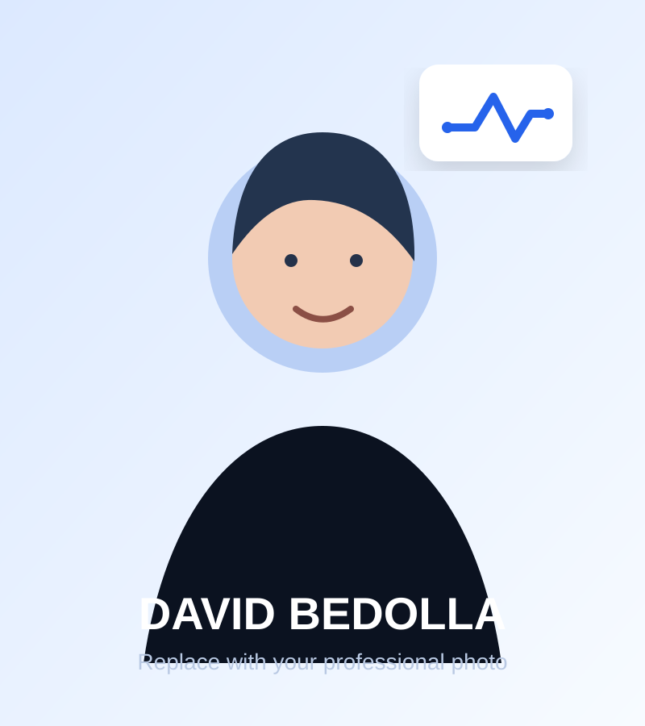
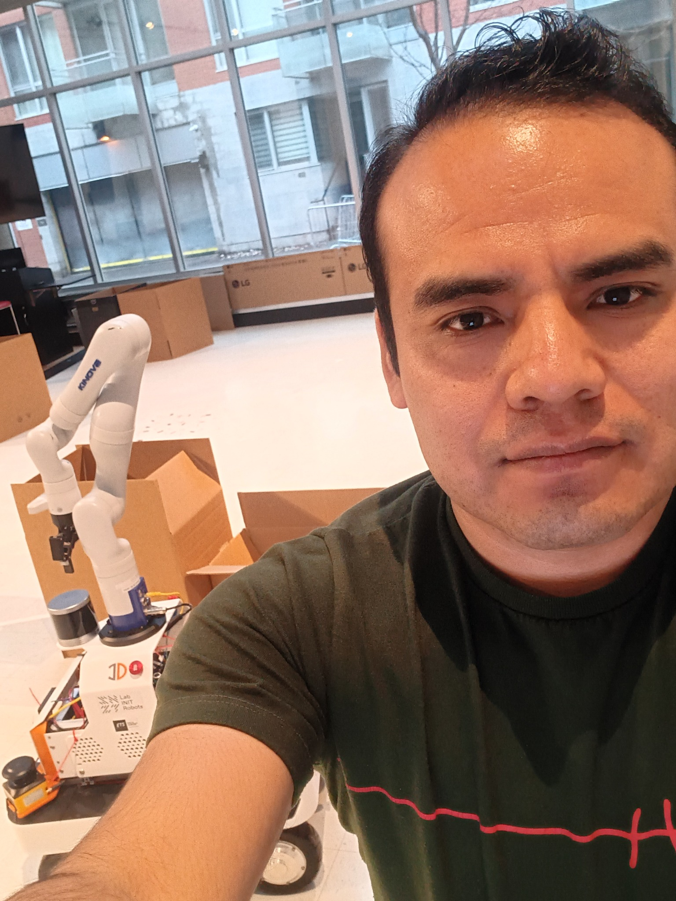

# David Bedolla Robotics Portfolio

Complete static portfolio project for:

- Public repository: `https://github.com/BedollaDavidPhD/BedollaDavidPhD.github.io`
- GitHub Pages URL: `https://bedolladavidphd.github.io/`

The local project folder remains the editable source of truth for the public GitHub Pages site.

The project uses plain HTML, CSS, and JavaScript. It has no framework, package manager, or build dependency.

The optional `tools/build_sites_preview.mjs` script packages the same static files for a private Sites preview; it does not change the GitHub Pages workflow.

## Presentation and behavior

- The live page uses the original-quality profile photo, INIT Robots logo, and social card.
- Visitors can switch between a clear light theme and a high-contrast dark theme.
- Browser-level machine translation is disabled because the site provides curated English, Spanish, and French copy; names, credentials, acronyms, and common engineering terms remain stable across languages.
- The theme follows the visitor’s system preference on first visit and remembers their choice.
- Project illustrations load only when visitors approach them.
- A project illustration can be replaced with a YouTube embed by pasting its URL into `assets/data/project-media.json`.
- Embedded project demonstrations start muted when they enter the viewport and pause after leaving it.
- The portfolio case studies now include verified software architecture, real-time control, planning, reinforcement-learning, and hardware evidence.
- Eight Dynamics Forge simulations cover a two-link arm, Copter 1-3, Drone 4/6/8, and the 18-rotor TaxiDrone in a browser worker with editable controller gains, CAD, links, coordinate frames, center-of-mass markers, multiple views, response plots, and a red XYZ target marker. Gain labels remain compact while their information icons identify the controlled loop and explain the P, I, or D action. Every run lasts 10 seconds. All seven rotor systems use Featherstone articulated-body dynamics, physical rotor thrust and drag, motor delay and limits, encoder quantization, state estimation, and direct unnormalized rotor-group mixing.
- Private Overleaf source material is stored locally under `source-materials/` and excluded from Git.

## Deploy to GitHub Pages

1. Use the public `BedollaDavidPhD.github.io` repository under `BedollaDavidPhD`.
2. Upload the contents of this local project folder to the root of the repository's `main` branch.
3. Keep the same file and folder structure.
4. Confirm that `index.html` is at the repository root.
5. Open **Settings > Pages** in GitHub.
6. Choose **Deploy from a branch**.
7. Select `main` and `/(root)`.
8. Save.

Do not upload the enclosing project folder as an additional directory inside the repository.

## Local preview

From the project directory, run:

```bash
python -m http.server 8000
```

Open `http://localhost:8000` in a browser.

## Main files

- `index.html`: website content and structure
- `assets/css/styles.css`: responsive design
- `assets/js/main.js`: navigation, animations, and footer year
- `assets/images/`: profile placeholder and project illustrations
- `assets/images/profile.jpg`: original-quality profile image used by the website
- `assets/images/init-robots-logo.png`: original-quality INIT Robots logo used by the website
- `assets/data/project-media.json`: project-to-YouTube URL mapping; blank URLs keep the current illustrations
- `assets/data/dynamics-forge-demos.json`: editable web-demo systems, controls, camera views, and CAD references
- `assets/js/dynamics-forge-demos.js`: interactive CAD viewer, controls, playback, and plots
- `assets/js/dynamics-forge-level4.js`: static-browser articulated model, rotor-force, actuator, encoder, estimator, and numerical-safety pipeline
- `assets/js/dynamics-forge-worker.js`: browser-side simulation worker and demo dispatcher
- `assets/models/dynamics-forge/`: CAD exported from the Dynamics Forge project
- `documents/David_Bedolla_CV.pdf`: downloadable CV
- `tools/create_cv_pdf.py`: editable CV PDF generation source
- `tools/sync_dynamics_forge_web_assets.py`: refreshes the selected CAD from Dynamics Forge
- `tools/build_sites_preview.mjs`: private preview packaging helper
- `tools/test_dynamics_forge_worker.cjs`: deterministic worker and attitude-to-translation coupling checks
- `docs/PROFILE_CONSISTENCY_REVIEW.md`: decisions needed to align the website and CV
- `docs/DYNAMICS_FORGE_DEMOS.md`: browser-demo architecture, reliability boundary, and update instructions
- `source-materials/overleaf-projects/`: private editable LaTeX sources, excluded from Git and public deployment
- `404.html`: custom not-found page
- `robots.txt` and `sitemap.xml`: search-engine metadata
- `.nojekyll`: prevents Jekyll processing

## Replace the profile illustration

Add a professional photo as:

`assets/images/profile.jpg`

Then replace this line in `index.html`:

```html

```

with:

```html

```

## Information to verify

Before sharing the site publicly, review the email, LinkedIn URL, employment dates, impact metrics, publication details, and CV contents.

See `docs/CUSTOMIZATION.md` for a detailed editing guide.
